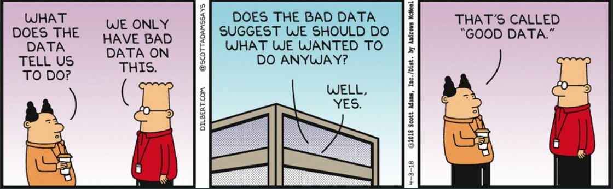
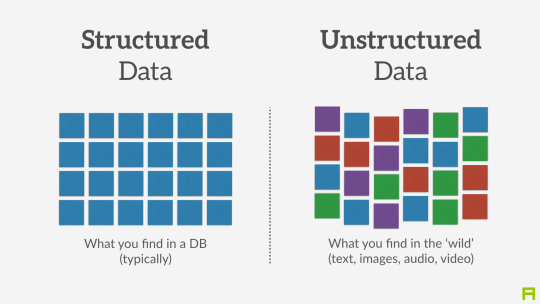
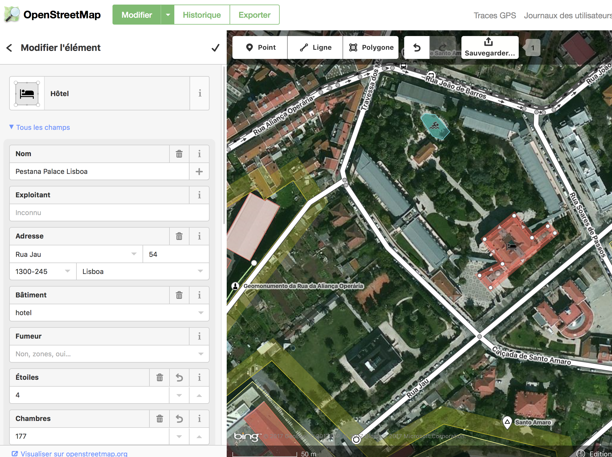
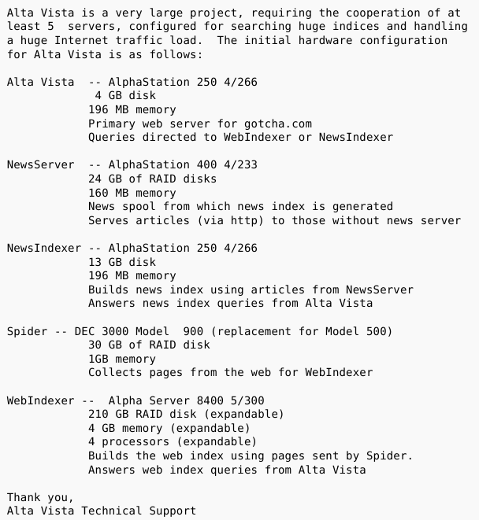
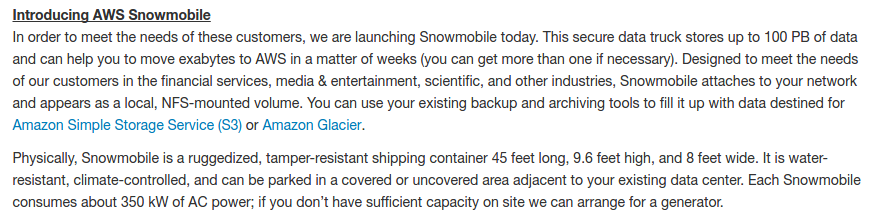
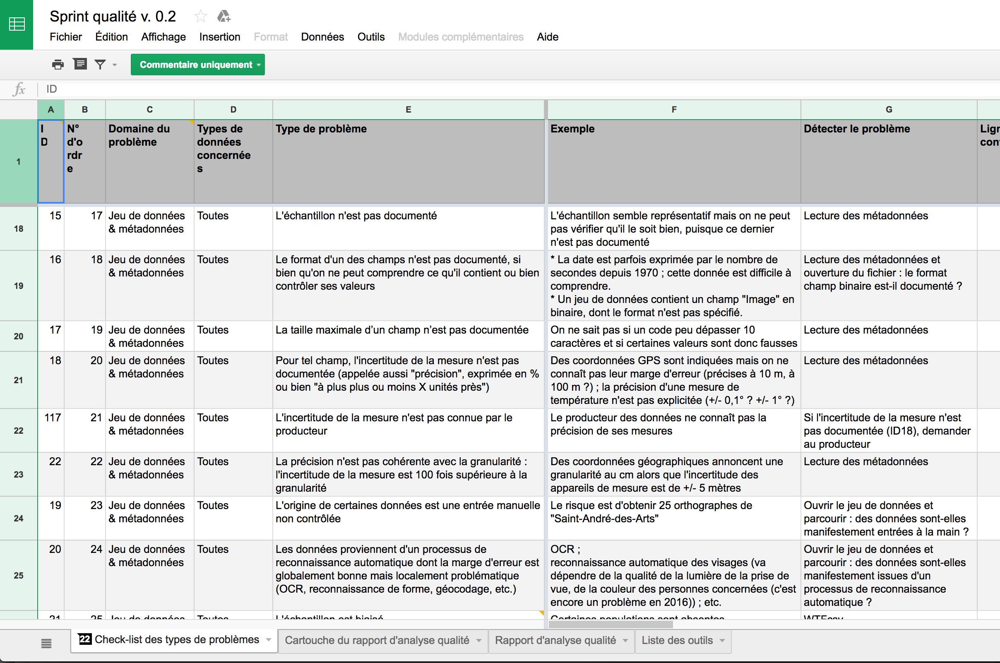
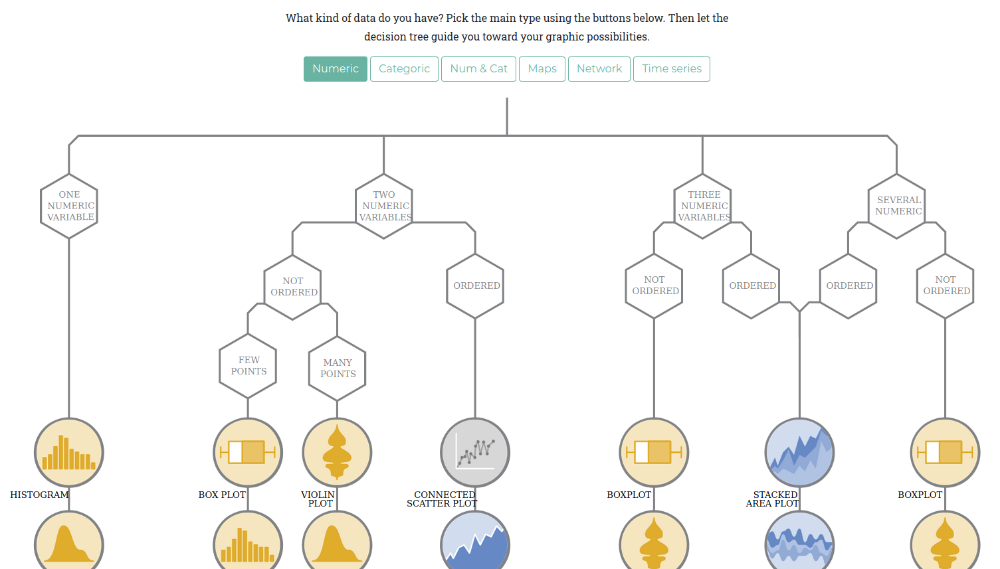
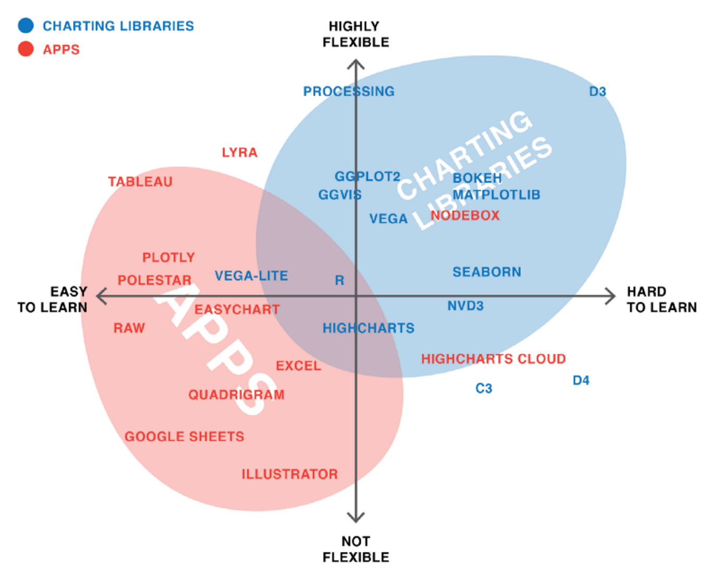

```{r, echo=FALSE}
library(metathis)
meta() %>% 
  meta_description(params$event) %>% 
  meta_name("github-repo" = paste0("datactivist/", params$slug)) %>% 
  meta_viewport() %>% 
  meta_social(
    title = params$title,
    url = paste0("https://datactivist.coop/", params$slug, "/1"),
    image = params$image,
    image_alt = params$image_alt,
    og_type = "website",
    og_author = "Datactivist",
    og_locale = "fr_FR",
    og_site_name = "Datactivist",
    twitter_card_type = "summary",
    twitter_creator = "@datactivi_st")

```


layout: true

<style>
.remark-slide-number {
  position: inherit;
}

.remark-slide-number .progress-bar-container {
  position: absolute;
  bottom: 0;
  height: 4px;
  display: block;
  left: 0;
  right: 0;
}

.remark-slide-number .progress-bar {
  height: 100%;
  background-color: #e95459;
}

</style>
  

`r paste0("<div class='my-footer'><span>", params$event, "</span> <center><div class=logo></center></span></div>")` 

---

class: center, middle

Ces slides en ligne : `r paste0("http://datactivist.coop/", params$slug, "/1")`

Sources : `r paste0("https://github.com/datactivist/", params$slug)`


Les productions de Datactivist sont librement réutilisables selon les termes de la licence [Creative Commons 4.0 BY-SA](https://creativecommons.org/licenses/by-sa/4.0/legalcode.fr).

<BR>
<BR>


---
## Qui sommes-nous ?

<BR><BR><BR><BR>

[](https://datactivist.coop)

### We .red[open data], we make them .red[useful]

---
## Qui sommes-nous ?


---
## Qui sommes-nous ?

- Datactivist est un .red[**pure player de l’open data**] créé en 2016, par Samuel Goëta et Joël Gombin.

- Se positionnant sur .red[**toutes les étapes du travail d’ouverture des données**], Datactivist travaille tant avec les producteurs de données qu’avec les réutilisateurs et participe à l’appropriation des données par chacun.

- Nous appliquons nos propres .red[**valeurs**] : nous sommes une coopérative ; nos supports de formation et nos contenus sont librement réutilisables, publiés en licence Creative Commons.

- Une approche issue de la recherche : voir notamment **https://datactivist.coop/these**. 

- Nous animons la communauté [#TeamOpenData](https://teamopendata.org).

---
## Nos activités

- Conseil sur les .red[**stratégies d’ouverture de données**] : nous aidons les organisations dans la conception et la mise en œuvre de leur stratégie d’ouverture de données.


- .red[**Accompagnement dans la réutilisation de données ouvertes**] : nous aidons les organisations à utiliser les données au quotidien. 

- .red[**Sensibilisation et formation à la donnée**] : nous formons à la culture générale des données, nous enseignons les grands principes et bonnes pratiques de l'open data et nous introduisons à la data science. 

- .red[**Médiation de données**] : nous organisons des hackathons, des open data camps, des expéditions de données...

???

La médiation de données est aussi fondamentalement une animation de communauté(s). 


---
## Objectifs de la matinée
<BR> <BR>

- Comprendre ce qu'est une donnée


- Appréhender la variété des types de données existantes


- Comprendre les "nouveaux habits des données" : data science, big data, open data, data science...


---
class:middle, center
## Echauffement :
### 5 minutes, 20 données

Vous avez 5 minutes

Vous devez trouver 20 données dans notre environnement immédiat

Pas de recours aux écrans !

.footnote[[source](http://infolabs.io/5-minutes-20-donnees)]


```{r, echo=FALSE}
library(countdown)
solarized <- xaringanthemer:::solarized
countdown(minutes = 5, seconds = 00, 
          play_sound = TRUE,
            # Set timer theme to match solarized colors
          color_border              = solarized$magenta,
          color_text                = solarized$magenta,
          color_running_background  = solarized$cyan,
          color_running_text        = solarized$base02,
          color_finished_background = solarized$red,
          color_finished_text       = solarized$base3)
```

---
class:center,inverse, middle
# Qu'est-ce 
# qu'une donnée ?

---
## Le censeur à Rome, ancêtre de la statistique
.center[.reduite3[]]

.footnote[Source : *Asterix chez les pictes*, © Albert René 2013]
---
## Le censeur à Rome, ancêtre de la statistique
.center[.reduite3[]]

.footnote[*Asterix chez les pictes*, © Albert René 2013]
---
## La statistique : outil de gouvernement et de preuve
.pull-left[.middle[La statistique est à la fois :

  + **outil de gouvernement** (_Statistik_ - 18e siècle), et
  
  
  + **outil de preuve** (_statistics_ - 19e siècle)]]
.pull-right[.reduite2[]]
---
  
## [Quantifier, c'est convenir puis mesurer](http://www.pressesdesmines.com/media/extrait/PourSocioHistExtr.pdf)

.pull-left[
> Le verbe quantifier est employé ici dans un sens large : **exprimer et
faire exister sous une forme numérique ce qui, auparavant, était exprimé par
des mots et non par des nombres**.]

.pull-right[.reduite2[]]

---
## [Quantifier, c'est convenir puis mesurer](http://www.pressesdesmines.com/media/extrait/PourSocioHistExtr.pdf)

.center[.reduite3[]]

.footnote[*Asterix chez les pictes*, © Albert René 2013]

---
## Quantifier, c'est inscrire et figer une réalité sans cesse mouvante

.center[.reduite3[]]

.footnote[*Asterix chez les pictes*, © Albert René 2013]

---
class:inverse, middle, center
# Vers une définition des données

---
## Etymologie

### Latin : _dare_ (donner) > _datum_ (donné) > _data_ (donnés)
<br/><br/>
Ce qui est évident, va de soi, est accepté sans discussion

<br/><br/>

> L'existence d'une donnée est indépendante de toute considération de la vérité ontologique correspondante. Lorsqu'un fait s'avère être faux, il cesse d'être un fait. 
Les fausses données n'en restent pas moins des données.

.footnote[[Rosenberg, 2013](https://mitpress.mit.edu/books/raw-data-oxymoron)]

---

## Vers une définition

.pull-left[.reduite3[


⏺ enregistrabilité +🏗 briques de base ("*buildings blocks*")]]
.pull-right[
> *Les données sont généralement comprises comme étant la matière première produite par la synthèse du monde en catégories, mesures et autres formes de représentation - nombres, caractères, symboles, images, sons, ondes électromagnétiques, bits - qui constituent les éléments de base à partir desquels l'information et le savoir sont créés. *]

---
Class:
## La pyramide Data-Information-Knowledge-Wisdom

.pull-left[
[](https://commons.wikimedia.org/w/index.php?curid=37705247)
]

.pull-right[Attribuée à [Russell Ackoff](http://en.wikipedia.org/wiki/Russell_L._Ackoff), 1989

Les données peuvent être des :

- faits
- signal/stimulis
- symboles]

---
Class:
## La pyramide Data-Information-Knowledge-Wisdom

- Les **.red[données]** sont la matière "brute" d'où naît l'information.

- **.red[L'information]** pourrait être définie comme des données qui ont été consignées,
classées, organisées, raccordées ou interprétées dans un cadre qui en dégage le sens

- En donnant du sens à de l'information, on obtient de la **.red[connaissance]**

- En donnant du sens à la **.red[connaissance]** on obtient du savoir

---
Class:
## La pyramide Data-Information-Knowledge-Wisdom

.center[]

_NB : le haut de la pyramide, est parfois remplacé par "compétence"_

---
class: inverse, center, middle

## La mise en données du monde

---
## "Datafication" : la mise en données du monde
> “L'immense gisement de données numériques découle de la capacité à paramétrer des aspects du monde et de la vie humaine qui n'avaient encore jamais été quantifiés. On peut qualifier ce processus de **« mise en données » (datafication)**. 

> […] “La mise en données désigne autre chose que la numérisation, laquelle consiste à traduire un contenu analogique - texte, film, photographie - en une séquence de 1 et de 0 lisible par un ordinateur. Elle se réfère à une action bien plus vaste, et aux implications encore insoupçonnées : **numériser non plus des documents, mais tous les aspects de la vie**.”

.footnote[[Kenneth Cukier, “Mise en données du monde, le déluge numérique”](https://www.monde-diplomatique.fr/2013/07/CUKIER/49318)]

---

## La "nombrification" du monde

.pull-left[.reduite[]]
.pull-right[
> La numérisation ne serait pas survenue sans une "nombrification" préalable qui consiste à quantifier de plus en plus d'aspects de notre expérience du réel.
> **Au commencement était le verbe, il semble à la fin que tout devient nombre.**
> Personne ne saurait parler sérieusement de l'état de la société et discuter politique sans se référer aux informations quantitatives.]

---
Class: middle, center

## La mise en données du monde

- **Concrètement, aujourd'hui, quels aspects de votre vie sont mis en données ?**

--

- Recherches internet, pratiques sportives, consommation énergie, régime alimentaire, trajets dans les transports en commun...

- Cette mise en donnée est rendue possible par le développement de .red[**capteurs**] qui viennent collecter et agréger ces données. **Avez-vous des exemples de capteurs ?**

--

- Recherches internet .red[(cookies)], pratiques sportives .red[(montres connectées)], consommation énergie .red[(compteurs connectés)], régime alimentaire .red[(appli type Yuka)], trajets dans les transports en commun .red[(Pass Navigo)]...

- La question devient peut-être, *quels aspects de votre vie ne sont pas (encore) mis en données ?*

---
### Exemple : les données de bornage des téléphones

[](https://www.nytimes.com/interactive/2019/12/19/opinion/location-tracking-cell-phone.html)

---
### Le nouveau positivisme des données

> Si vous me demandiez de décrire la philosophie naissante du jour, je dirais que c’est du **data-isme**. Nous sommes maintenant en mesure de collecter d'énormes quantités de données. Cette capacité semble comporter certaines hypothèses culturelles - à savoir que **tout ce qui peut être mesuré doit être mesuré; que les données constituent un filtre transparent et fiable nous permettant de mettre côté les émotions et l'idéologie**; ou encore que les données nous aideront à faire des choses remarquables - comme prédire l'avenir

David Brooks, éditorialiste du New York Times, ["The Philosophy of Data"](https://www.nytimes.com/2013/02/05/opinion/brooks-the-philosophy-of-data.html)

.center[]

---
## Le nouveau positivisme des données

- Attention, les données, même provenant de sources officielles, ne sont pour autant neutres, irréprochables ou porteuses de "LA" vérité

.center[]

- **Avez-vous des exemples de données officielles pouvant faire l'objet de critiques ?**
--

- Délinquance, immigration, SDF...

.footnote[© Scott Adams]


---

### Exemple : les données de la déliquance

.center.middle[
<iframe width="560" height="315" src="https://www.youtube.com/embed/bMZ4YVrIY_s" frameborder="0" allow="accelerometer; autoplay; encrypted-media; gyroscope; picture-in-picture" allowfullscreen></iframe>
]

---
Class:

### Les données brutes sont un oxymore

.pull-left[
> Les données sont toujours "cuisinées" et jamais tout à fait "brutes"


> Les données ont besoin au préalable d'être imaginées comme données pour exister et fonctionner comme telles. L'imagination de ces données implique une base d'interprétation

]
.pull-right[


.footnote[© Xavier Gorce 2018]]

.footnote[[Source](https://mitpress.mit.edu/books/raw-data-oxymoron)]
---

### Data or capta ?

> Techniquement, ce que nous nous appelons "donnée" est généralement **"capturé"** (issu du latin "capere", signifiant "prendre"); ces unités de données qui ont été sélectionnées et collectées parmi l'ensemble de toutes les données possibles.


[Kitchin, 2014](https://books.google.fr/books?hl=fr&lr=&id=GfOICwAAQBAJ&oi=fnd&pg=PP1&dq=kitchin+data+revolution&ots=pcyfMTZh-V&sig=dQyPTL3AIN_4RdWvtBFw4VjdAa4#v=onepage&q=kitchin%20data%20revolution&f=false)

.center[] 

---

## Données ou obtenues ? 


> Décidément, on ne devrait jamais parler de “données”, mais toujours d’ “obtenues”.

[Bruno Latour, 1993](http://www.bruno-latour.fr/fr/node/255)

.center[] 

---
class:center, middle, inverse

## Pause café : 15 minutes

```{r, echo=FALSE}
countdown(minutes = 15, seconds = 00, 
          play_sound = TRUE)
```


---

class:center, middle, inverse
# Données, données... quelles données ?

---

## Données quantitatives

Différents types de variables : 
- **Nominale** : des catégories que l’on nomme avec un nom (marié/célibataire/divorcé/veuf)


- **Ordinale** : échelle de mesure dotant chaque élément d'une valeur qui permet leur classement par ordre de grandeur (faible, moyen, fort)


- **Métriques** : Au lieu de classer, on mesure et on attribue à chaque élément un nombre qui est tel que des intervalles numériques égaux représentent des distances égales dans la propriété mesurée (ex : température).  

---

## Données qualitatives

.pull-left[
Non numérique => texte, image, vidéo, son, musique...

  + peuvent être converties en données quantitatives

  + risque de perdre la richesse des données originales
  
  + analyse qualitative de données
  
]
.pull-right[

]

---

## Exemple : les annotations en text mining

.reduite[]

---
### Exemple : la [grande annotation](https://grandeannotation.fr/)


]

---

## Données non structurées

.pull-left[Pas de structure commune identifiable


Exemple : BDD NoSQL

Généralement qualitatives

Difficilement combinées ou analysées quantitativement..

Les données non structurées croitraient 15x plus que les données structurées.
 
Machine learning de + en + capable d'analyser ces données.]

.pull-right[

]

---

## Données capturées, échappées, transitoires 

** Données capturées**

Observation, enquête, expérimentation, prise de notes, senseurs... => intention de générer des données

** Données échappées**

Sous-produit d'un engin ou d'un système dont la fonction première est autre
** Avez-vous des exemples de données échappées ?**
--

Parking, borne d'accès... et beaucoup de données administratives ouvertes !

** Données transitoires**

Echappées qui ne sont jamais examinées, transformées ou analysées


---
## Données dérivées

Résultat d'un traitement ou une analyse supplémentaire de données capturées. 

Exemple avec les [données de Google Maps](https://www.justinobeirne.com/google-maps-moat) : 


---

##Index, attributs, métadonnées

**Index**

Des données permettent l'identification et la mise en relation. Essentielles pour enrichir les données. Exemple : SIRET. 

**Attributs**

Des données représentent les aspects d'un phénomène, mais ne sont pas des index (pas identifiants uniques).

**Métadonnées**

Des données sur les données. Peuvent être descriptives, structurelles ou administratives. Exemple de standard : le [Dublin Core](https://fr.wikipedia.org/wiki/Dublin_Core). 

---

## Les données crowdsourcées

Des données produites par des citoyens, qui sont éventuellement des communs partagés et gouvernés par leurs producteurs

**Connaissez-vous un site ou une application fonctionnant via des données crowdsourcées ?**

--

.pull-left[Exemple : OpenStreetMap, le wiki de la carte]

.pull-right[
.reduite[]
]

---
## Exemple : OpenStreetMap

.center[] 

---
class:inverse, middle, center
# Big data

---

## Les 4 V du Big data


---

## L'obsession du volume de données

.pull-left[
**Quelques chiffres omniprésents** : 
- le volume de données produit double tous les 3 ans (Gantz & Reisel 2011)
- 90% des données créées dans les deux dernières années (IBM 2012)
- 40% : croissance annuelle de la production de données (Maniyka et al. 2011) 
]
.pull-right[
**Problèmes de cette approche** : 
- Estimations guidées par des intérêts commerciaux
- Ne définit pas ce que sont ces données
- Résume le big data au Volume
-Explique mal la mise en données du monde

]

---

## Les promesses du big data

** Selon vous, quels sont les intérêts du big data ?**

--

Kitchin (2014) résume les promesses du big data : 
- **“Administrer les citoyens”** : dans la continuité de la statistique, améliorer la connaissance de l’administration et prédire l(par exemple, es crimes
)
- **“Gérer les organisations”** : améliorer le fonctionnement de toutes les composantes de l’organisation par l’exploitation des données

- **“Accroître la valeur”** : micro-ciblage marketing, optimisation des magasins et des opérations, efficience de la chaine

- **“Créer de meilleurs endroits”** : gouverner les villes avec des données (smart city) 

- **Un nouveau paradigme scientifique** : une nouvelle ère guidée par les corrélations
, sans théorie
---

## Linked data


- poussé par le W3C et Tim Berners-Lee
- sémantique / web des données
- S'appuyer sur des formats ouverts : RDF / SPARQL
- wikidata => http://projetjourdain.org/network/index.htm

.center[]

---

## API

.pull-left[
- Application programming interface => un programme vu de la surface

- les machines parlent aux machines

- donnée dynamique => ouverture potentiellement limitée et contrôlée 

- un exemple : [overpass turbo](https://overpass-turbo.eu/)]
.pull-right[

]

---
class:center, middle, inverse

## Pause café : 10 minutes

```{r, echo=FALSE}

countdown(minutes = 10, seconds = 00, 
          play_sound = TRUE)

```


--
class:inverse, middle, center
## Qu'est-ce que la data science ?

---
class:middle

## Au commencement était la statistique

- une vieille science (18e siècle), pour aider les États (_Statistik_) mais aussi des entreprises privées (au départ, les assureurs => actuariat)

- fondée sur les probabilités

- faite par des mathématiciens

- forte dimension théorique

---
class:middle
## Data science : les nouvelles statistiques ?

> Je continue à dire que le travail sexy dans les dix prochaines années sera celui de statisticien. Les gens pensent que je plaisante, mais qui aurait deviné que les ingénieurs en informatique auraient été le métier sexy des années 1990 ?

Hal Varian (Chief economist, Google), The McKinsey Quarterly, January 2009


> “e pense que data-scientist est un terme glamour pour désigner un statisticien”.
[Nate Silver](http://www.statisticsviews.com/details/feature/5133141/Nate-Silver-What-I-need-from-statisticians.html)
---

## Data science is the new statistics?

.center[.reduite[]]

---
## Développement de la puissance de calcul

[](http://visual.ly/infographic-about-computers)
---
## Développement de la capacité de stockage

[](https://twitter.com/alicemazzy/status/655306196128280576?ref_src=twsrc%5Etfw)
---
## Développement de la capacité de stockage

[](https://aws.amazon.com/blogs/aws/aws-snowmobile-move-exabytes-of-data-to-the-cloud-in-weeks/)

.center[]

---
Class: middle
## Que fait-on une fois qu'on a des données ?

### Modélisation

- Un modèle réduit de la réalité pour analyser, expliquer ou prédire

Modéliser, c’est mettre en relation une *variable expliquée*
(dépendante / prédite) et une ou plusieurs *variables explicatives*
(indépendantes / prédicteurs).


---
## Pourquoi modéliser ?

.reduite[.center[]]


---
## Pourquoi modéliser ? Les ["deux cultures"](https://projecteuclid.org/download/pdf_1/euclid.ss/1009213726)

- pour analyser et expliquer

- pour prédire

---
## Pourquoi modéliser ? Les ["deux cultures"](https://projecteuclid.org/download/pdf_1/euclid.ss/1009213726)

- pour analyser et expliquer (**statistiques classiques, économétrie**)

- pour prédire (**machine learning, IA...**)

### Tous les modèles sont faux, certains sont utiles

---
## Et le machine learning alors ?

- Fondamentalement, modélisation et machine learning ne sont pas différents, du point de vue d'un statisticien : modéliser un $Y$ en fonction d'un vecteur de $X_i$

- une des différences principales toutefois : veut-on prévoir ou comprendre/analyser ?


- en pratique : machine learning porte sur des données plus complexes que la modélisation traditionnelle

- Souvent beaucoup de valeurs manquantes 

---
## Concepts de machine learning

- Apprentissage supervisé vs non supervisé 

- Apprentissage supervisé : il faut des données déjà classées/étalonnées. Souvent à la main ! => *[#digitallabour](https://journals.openedition.org/lectures/19584)*

---
## Apprentissage supervisé 

[.reduite[.center[]]](https://fakecaptcha.com)

---
## Apprentissage supervisé

[.reduite[.center[]]](https://cquest.hackpad.com/OpenSolarMap-9oMiYswLksF)

---
class: center, middle, inverse

# Le data pipeline

---

## Le pipeline de données


---
## Vérifier les données

[](http://www.erogol.com/ml-work-flow-part-4-sanity-checks-data-spliting/)

---
## Vérifier les données

[](http://infolabs.io/sprint-qualite)

---
## Nettoyer les données

Paradigme du [_tidy data_](http://vita.had.co.nz/papers/tidy-data.pdf) (Hadley Wickham)

> “Les familles heureuses sont toutes pareilles; chaque famille malheureuse est malheureuse à sa manière.” – Leon Tolstoï 

> “Les jeux de données ordonnés se ressemblent tous, mais chaque jeu de données désordonné est désordonné à sa manière
.” – Hadley Wickham

**Principes du *tidy data* ("données ordonnées")**
- Chaque variable correspond à une colonne
- Chaque observation/individu correspond à une ligne
- Chaque type d'unité d'observation correspond à une table
- Chaque cellule comporte une donnée 

---
# Analyser et modéliser les données

C'est le cœur de la data science... et souvent le plus rapide, paradoxalement. 

---
# Visualiser les données
### Choisir un format de visualisation

.center[.reduite[[](https://www.data-to-viz.com/)]]

---
# Visualiser les données
### Trouver un outil
.reduite[[](https://source.opennews.org/articles/what-i-learned-recreating-one-chart-using-24-tools/)]


---
class: inverse, center, middle

# Merci !

Contact : [joel@datactivist.coop](mailto:joel@datactivist.coop)