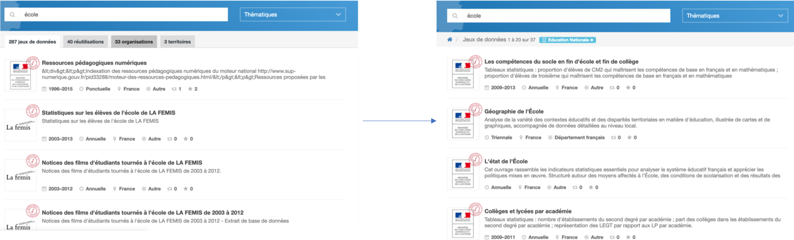

```{r, echo=FALSE}
library(metathis)
meta() %>% 
  meta_description(params$event) %>% 
  meta_name("github-repo" = paste0("datactivist/", params$slug)) %>% 
  meta_viewport() %>% 
  meta_social(
    title = params$title,
    url = paste0("https://datactivist.coop/", params$slug, "/1"),
    image = params$image,
    image_alt = params$image_alt,
    og_type = "website",
    og_author = "Datactivist",
    og_locale = "fr_FR",
    og_site_name = "Datactivist",
    twitter_card_type = "summary",
    twitter_creator = "@datactivi_st")

```


layout: true

<style>
.remark-slide-number {
  position: inherit;
}

.remark-slide-number .progress-bar-container {
  position: absolute;
  bottom: 0;
  height: 4px;
  display: block;
  left: 0;
  right: 0;
}

.remark-slide-number .progress-bar {
  height: 100%;
  background-color: #e95459;
}

</style>
  

`r paste0("<div class='my-footer'><span>", params$event, "</span> <center><div class=logo></center></span></div>")` 

---

class: center, middle

Ces slides en ligne : `r paste0("http://datactivist.coop/", params$slug, "/1")`

Sources : `r paste0("https://github.com/datactivist/", params$slug)`


Les productions de Datactivist sont librement réutilisables selon les termes de la licence [Creative Commons 4.0 BY-SA](https://creativecommons.org/licenses/by-sa/4.0/legalcode.fr).

<BR>
<BR>


---
### Qui sommes-nous ?

<BR><BR><BR><BR>

[](https://datactivist.coop)

### We .red[open data], we make them .red[useful]

---
### Qui sommes-nous ?


---
### Qui sommes-nous ?

- Datactivist est un .red[**pure player de l’open data**] créé en 2016, par Samuel Goëta et Joël Gombin.

- Se positionnant sur .red[**toutes les étapes du travail d’ouverture des données**], Datactivist travaille tant avec les producteurs de données qu’avec les réutilisateurs et participe à l’appropriation des données par chacun.

- Nous appliquons nos propres .red[**valeurs**] : nous sommes une coopérative ; nos supports de formation et nos contenus sont librement réutilisables, publiés en licence Creative Commons.

- Une approche issue de la recherche : voir notamment **https://datactivist.coop/these**. 

- Nous animons la communauté [#TeamOpenData](https://teamopendata.org).

---
### Nos activités

- Conseil sur les .red[**stratégies d’ouverture de données**] : nous aidons les organisations dans la conception et la mise en œuvre de leur stratégie d’ouverture de données.


- .red[**Accompagnement dans la réutilisation de données ouvertes**] : nous aidons les organisations à utiliser les données au quotidien. 

- .red[**Sensibilisation et formation à la donnée**] : nous formons à la culture générale des données, nous enseignons les grands principes et bonnes pratiques de l'open data et nous introduisons à la data science. 

- .red[**Médiation de données**] : nous organisons des hackathons, des open data camps, des expéditions de données...

???

La médiation de données est aussi fondamentalement une animation de communauté(s). 

---

### Réutiliser les données : un parcours fait de joies et de déceptions

.center.reduite[

]

---

### Définir

.pull-left[
.reduite[]
]
.pull-right[

#### Définir précisément votre problème

#### Que cherchez vous à comprendre ?

#### Quelles données vous seraient utiles ?

]

---

### Définir, c'est trouver un angle à votre sujet


.footnote[[](https://fr.okfn.org/2014/07/03/a-la-conquete-des-donnees-sur-la-pollution-de-lair/)]

---

### La Wanted Data List pour définir ses besoins de données

<iframe class="airtable-embed" src="https://airtable.com/embed/shrZA0sl2dVmHmAjJ?backgroundColor=cyan&layout=card&viewControls=on" frameborder="0" onmousewheel="" width="100%" height="450" style="background: transparent; border: 1px solid #ccc;"></iframe>

---

### Exercice en groupe

0. Constituez des groupes autour d'une thématique : la gastronomie, le Tour de France, le rock, la pollution des rivières, la propagation des virus…

1. Trouvez 2-3 angles pour vos analyses

2. Commencez une wanted data list pour définir vos besoins de données

.red[Vous avez 7 minutes]


```{r, echo=FALSE}
library(countdown)
solarized <- xaringanthemer:::solarized
countdown(minutes = 7, seconds = 00, 
          play_sound = TRUE,
            # Set timer theme to match solarized colors
          color_border              = solarized$magenta,
          color_text                = solarized$magenta,
          color_running_background  = solarized$cyan,
          color_running_text        = solarized$base02,
          color_finished_background = solarized$red,
          color_finished_text       = solarized$base3)
```

---

### Trouver

.pull-left[
.reduite[]
]
.pull-right[

#### Utiliser les opérateurs spéciaux

#### Chercher sur les portails open data

#### Utiliser les facettes pour trouver les bonnes données

#### Extraire des données d'OpenStreetMap

#### S'appuyer sur des ressources de [curation de données](https://teamopendata.org/t/curation-de-donnees-data-is-plural/734)
]

---
### Utiliser les opérateurs spéciaux

Exemple avec la requête "site:education.gouv.fr filetype:xlsx" :


---

### Utiliser les facettes pour trouver les bonnes données

.pull-left[

]

.pull-right[
Les facettes sont des filtres dans les métadonnées. 

Elles permettent de sélectionner par exemple uniquement un certain producteur. 

Cela peut faire gagner beaucoup de temps dans une recherche de données.
]
---
### Utiliser les facettes pour trouver les bonnes données


.pull-left[
Sans filtre par facette, à la requête écoles, on a des résultats étonnants en première page comme ces données de la FEMIS.  
]

.pull-right[
En gardant uniquement "Education Nationale"" dans la facette organisation, on s'assure de trouver des données nationales. 
]
---
### Utiliser Google Dataset Search

Google propose depuis quelques temps ce [moteur de recherche](https://toolbox.google.com/datasetsearch) aggrégant de très nombreux portails open data. Les résultats sont inégaux mais le moteur est encore nouveau…

[](https://toolbox.google.com/datasetsearch)

---
### Chercher dans le [réseau de données OpenDataSoft](data.opendatasoft.com)
OpenDataSoft référence tous les jeux de données publiés sur l'ensemble de ses portails. Parmi eux, le portail Public référence des jeux de données introuvables ailleurs comme la [localisation des radars](https://data.opendatasoft.com/explore/dataset/radars%40public/table/). 

---
### Trouver le bon tag sur OSM
La page "[Elements Cartographiques](https://wiki.openstreetmap.org/wiki/FR:%C3%89l%C3%A9ments_cartographiques)" sur le wiki d'OSM recense tous les tags utilisés dans la base de données. 

[](https://wiki.openstreetmap.org/wiki/FR:%C3%89l%C3%A9ments_cartographiques)
.footnote[Plus d'infos : https://datactivist.coop/atelier-osm/]

---
### Utiliser des [ressources de curation de données](https://teamopendata.org/t/curation-de-donnees-data-is-plural/734)

Je recense sur [TeamOpenData](https://teamopendata.org/t/curation-de-donnees-data-is-plural/734) les meilleures ressources de curation de données. Une recherche vous aidera à trouver des données internationales que vous ne trouverez généralement pas autrement. 

Par exemple, l'excellente [newsletter Data Is Plural](https://tinyletter.com/data-is-plural/) propose chaque semaine une présentation des meilleurs jeux de données qui sont archivés dans une [feuille de calcul](https://docs.google.com/spreadsheets/d/1wZhPLMCHKJvwOkP4juclhjFgqIY8fQFMemwKL2c64vk/edit#gid=0).

[](https://docs.google.com/spreadsheets/d/1wZhPLMCHKJvwOkP4juclhjFgqIY8fQFMemwKL2c64vk/edit#gid=0)

---

### Exercice en groupe

1. Reconstituez vos groupes

2. A partir de la wanted data list, cherchez des données en utilisant les techniques et conseils évoqués précédemment : 
* Recherche sur les portails open data
* Recherche Google
* Google Dataset Search
* Curation de données
* OSM

.red[Vous avez 10 minutes]


```{r, echo=FALSE}
library(countdown)
solarized <- xaringanthemer:::solarized
countdown(minutes = 10, seconds = 00, 
          play_sound = TRUE,
            # Set timer theme to match solarized colors
          color_border              = solarized$magenta,
          color_text                = solarized$magenta,
          color_running_background  = solarized$cyan,
          color_running_text        = solarized$base02,
          color_finished_background = solarized$red,
          color_finished_text       = solarized$base3)
```

---

### Récupérer 

.pull-left[
.reduite[]
]
.pull-right[

- #### Téléchargement direct

- #### API ou web service

- #### Scrapping de données

- #### Copier / coller

- #### Extraction (OpenStreetMap)


]

---

### Scrapping de données : quelques outils

[import.io](import.io) est un excellent outil qui facilite grandement l'extraction des données depuis un site web. L'outil détecte automatiquement la structure des données sur le site. 


.footnote[Loïc Haÿ a développé un [tutoriel](https://www.dropbox.com/s/yarrneyseghd7d6/05-%20Extraire%20des%20donn%C3%A9es%20%C3%A0%20partir%20de%20pages%20web.pdf?dl=0) pour utiliser import.io.]

---
### Scrapping de données : quelques outils

L'extension [Scraper](https://chrome.google.com/webstore/detail/scraper/mbigbapnjcgaffohmbkdlecaccepngjd?hl=fr) pour Chrome permet d'extraire en quelques clics les données d'un site. 


---

### Scrapping de données : quelques outils

L'extension Webscraper permet de capturer des données sur des sites avec une arborescence complexe. 

.red[
** Démonstration avec ce site qui référence la plupart des [escape games en France](https://www.escapegame.fr/france/)**
]


---
### Extraire des données d'OpenStreetMap

[Overpass-Turbo](overpass-turbo.eu) permet d'extraire des éléments spécifiques dans la base de données OpenStreetMap. Exemple ici avec les écoles dans l'Yonne : 


.footnote[Plus d'infos : https://datactivist.coop/atelier-osm/]
---
### Découverte d’Overpass
.reduite[]
.footnote[http://overpass-turbo.eu]

---
### Exercice : cartographier les éléments suivants

* Les boulangeries à Angers

* Les pistes cyclables à Auxerre

* Les aéroports en Bourgogne

* Les boites aux lettres à Aix en Provence 

**Plus dur :**

* Les lignes électriques en corse

* Les « potelets » à Marseille

---

### Vérifier 

.pull-left[
.reduite[]
]

.pull-right[

- #### Bon sens

- #### Demander à la source

- #### S'appuyer sur des communautés d’experts

- #### Statistiques


]

---
### S'appuyer sur les commentaires dans data.gouv.fr

data.gouv.fr permet aux usagers de discuter autour des données, cela vous aidera à détecter les problèmes avec les données. 

[](https://www.data.gouv.fr/fr/datasets/donnees-du-repertoire-national-des-elus/)

---

### WTFCsv pour faire un contrôle rapide des données

[WTFCSV](https://www.databasic.io/en/wtfcsv/) est un outil de médiation de données qui propose un aperçu de vos fichiers CSV. 

[](https://www.databasic.io/en/wtfcsv/results/5b73338c9dfb0a00e15f07ff#tooltip)

---

### Nettoyer 

.pull-left[
.reduite[]
]
.pull-right[

- #### Toilettage

- #### Edition

- #### Consolidation

- #### Erreurs fréquentes
* Format pour les dates
* Les doublons
* Les fautes d’orthographe

]

---
### Open Refine pour nettoyer les données

[OpenRefine](http://openrefine.org/) est un outil puissant pour explorer, transformer et rapprocher des données. 

<iframe width="560" height="315" src="https://www.youtube.com/embed/cO8NVCs_Ba0" frameborder="0" allow="accelerometer; autoplay; encrypted-media; gyroscope; picture-in-picture" allowfullscreen></iframe>

.footnote[Mathieu Saby a publié un [tutoriel complet](https://msaby.gitlab.io/atelier-openrefine-MASA/).]

---
### Le [sprint qualité](https://infolabs.io/sprint-qualite) pour détecter les problèmes dans les données

[](https://infolabs.io/sprint-qualite)

---
### Le [Quartz Bad Data Guide](https://infolabs.io/sprint-qualite) : un résumé des problèmes avec les données

[](https://github.com/Quartz/bad-data-guide)

---

### Un exercice de nettoyage de données

Workbench est un outil puissant et simple à utiliser pour nettoyer des données. Il propose des tutoriels et des recettes simples d'utilisation. Essayez cette [recette de nettoyage de données](https://app.workbenchdata.com/lessons/en/load-public-data).


```{r, echo=FALSE}
library(countdown)
solarized <- xaringanthemer:::solarized
countdown(minutes = 10, seconds = 00, 
          play_sound = TRUE,
            # Set timer theme to match solarized colors
          color_border              = solarized$magenta,
          color_text                = solarized$magenta,
          color_running_background  = solarized$cyan,
          color_running_text        = solarized$base02,
          color_finished_background = solarized$red,
          color_finished_text       = solarized$base3)
```

---

### Analyser 

.pull-left[
.reduite[]
]
.pull-right[

#### Type d’analyse
- Analyse statistique
- Analyse spatiale

#### Outils

- Tableur
- R
- QGIS (données géo)
- Etc.

]

---

### Présenter

.pull-left[
.reduite[]
]

.pull-right[

### Communiquer les résultats de votre analyse au public.

Flourish
https://flourish.studio/

Datawrapper
https://www.datawrapper.de/

Infogram
https://infogram.com/

DIVE
https://dive.media.mit.edu/

.footnote[Voir atelier cet après midi sur la visualisation de données]
]

---
### Pour terminer, testez vos compétences data


---
class: inverse, center, middle

# Merci !

Contact : [samuel@datactivist.coop](mailto:samuel@datactivist.coop)

