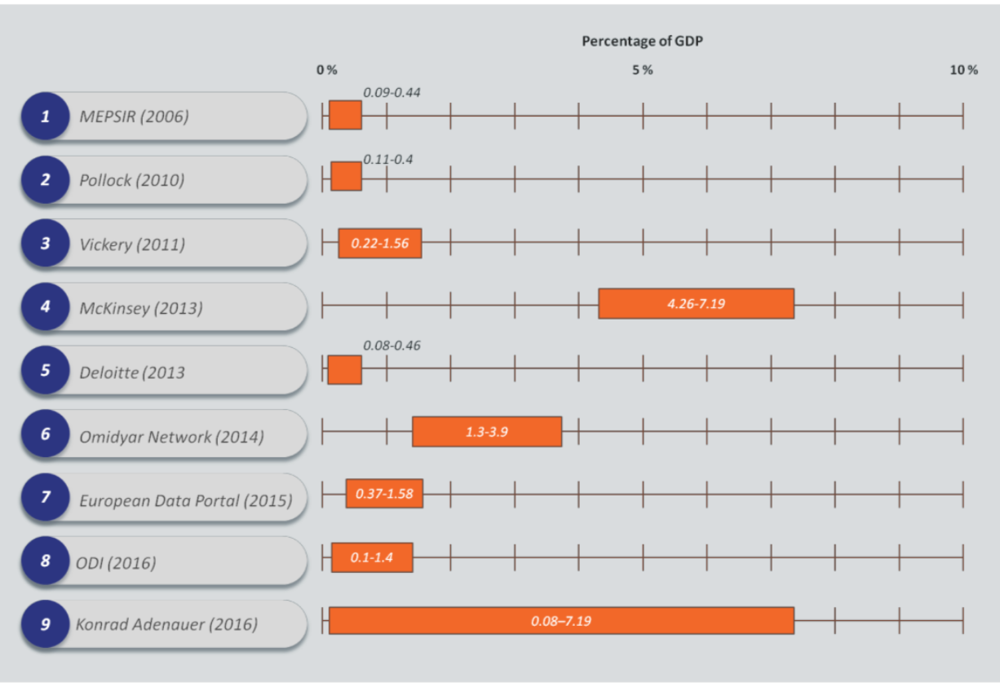
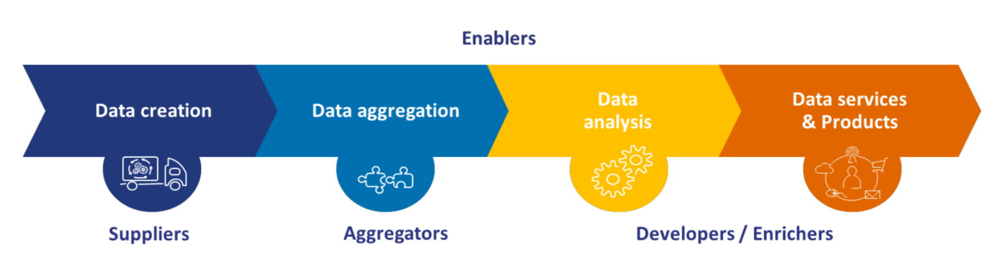
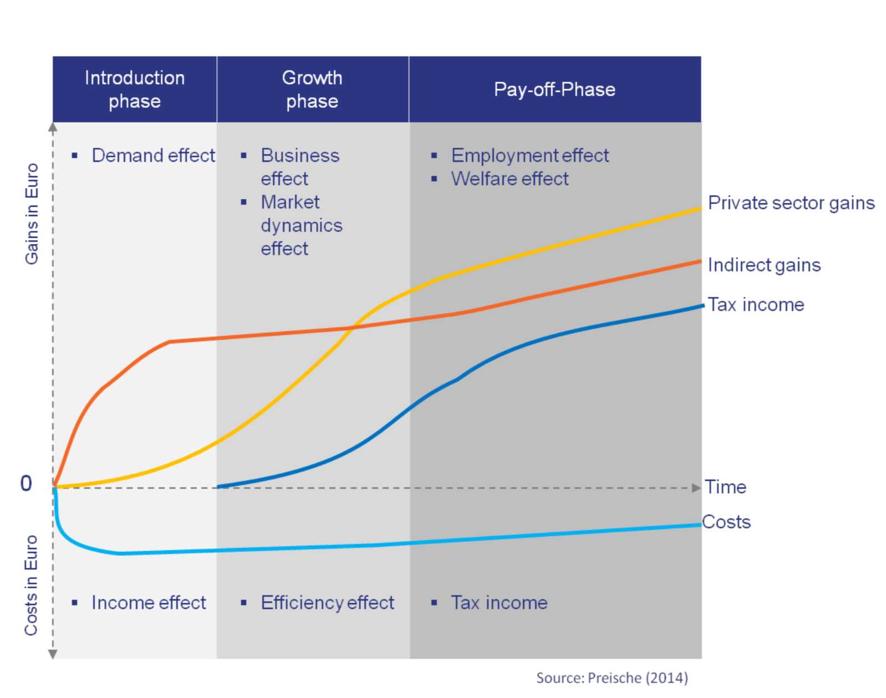

```{r, echo=FALSE}
library(metathis)
meta() %>% 
  meta_description(params$event) %>% 
  meta_name("github-repo" = paste0("datactivist/", params$slug)) %>% 
  meta_viewport() %>% 
  meta_social(
    title = params$title,
    url = paste0("https://datactivist.coop/", params$slug),
    image = params$image,
    image_alt = params$image_alt,
    og_type = "website",
    og_author = "Datactivist",
    og_locale = "fr_FR",
    twitter_card_type = "summary",
    twitter_creator = "@datactivi_st")

```

layout: true

<style>
.remark-slide-number {
  position: inherit;
}

.remark-slide-number .progress-bar-container {
  position: absolute;
  bottom: 0;
  height: 4px;
  display: block;
  left: 0;
  right: 0;
}

.remark-slide-number .progress-bar {
  height: 100%;
  background-color: #e95459;
}

</style>


`r paste0("<div class='my-footer'><span>", params$event, "</span> <center><div class=logo><a href='https://datactivist.coop/'></a></div></center></span></div>")` 


---

class: center, middle

Ces slides en ligne : `r paste0("http://datactivist.coop/", params$slug)`

Sources : `r paste0("https://github.com/datactivist/", params$slug)`


Les productions de Datactivist sont librement réutilisables selon les termes de la licence [Creative Commons 4.0 BY-SA](https://creativecommons.org/licenses/by-sa/4.0/legalcode.fr).

<BR>
<BR>


---
### Le "nouveau pétrole" : des conjectures de croissance et d'emploi disproportionnées 

.pull-left[
* Open data né en 2007 en même temps que l'AppStore 

* Contexte de la crise économique de 2008 : remettre de l'essence dans le moteur de l'économie

* Concours d'applications : un jeu de donnée = une app ?
]

.pull-right[


]
        
        
---
### Des études approximatives


.center[
.reduite[]
]
.footnote[

Des écarts considérables (de 1 à 10 ) dans les évaluations de l’impact de l’open data entre 0,4% et 7% du PIB mondial !]

---
### Comment expliquer de telles variations ? 

* **Différences de méthode d’évaluation** : certaines ont une approche « par le haut » en modélisant la part des données ouvertes dans la chaine de création de valeur macroéconomique tandis que d’autres études partent « du bas »  en évaluant l’impact de l’open data de manière sectorielle puis généralisent à l’ensemble de l’économie. 
--

* **Des études *ex-ante*, effectuées à partir de recherche et de modélisation** plutôt qu’*ex post* en mesurant l’impact économique constaté d’une mesure --> des prévisions plutôt que des mesures objectives.

--

* **Des définitions variables** : certaines études considèrent que certaines données partagées à des acteurs sélectionnés selon des conditions restrictives peuvent entrer dans l’estimation de valeur.

--
* **L'inclusion des externalités environnementales ou sociales indirectes** : analyse cout-bénéfices qui traduit de manière monétaire tous les aspects de la vie, équivalences monétaire à des phénomènes qui ne contribuent pas directement à la création de valeur économique. 

---
### Des promesses de créations d'emploi

.pull-left[

### 80k emplois dans l'UE, 9600 en France


]

.pull-right[

> Ce nombre est fondé sur une étude espagnole estimant le nombre d’emplois directs dans le secteur des infomédiaires espagnols à un niveau de 4200-4700 emplois. \[...\] la définition du secteur des infomédiaires dans l’étude espagnole est plus large que la part des entreprises qui ont un modèle économique basé sur l’open data. Cette mise en garde implique de prendre des précautions à l’égard de cette estimation. 

]

---
### Des créations d'entreprises dans l'ensemble de la chaine de valeur




.pull-left[
* OpenDataSoft
* Open Agenda
* Navitia (filiale de Keolis)
* Datactivisr…
]

.pull-right[
* Nam.r
* Plume
* Comoprices
* Tic Tac Trip
* Yuka
* Geovelo…
]

Et énormément d'acteurs non identifiés : besoin d'un OpenData500 français !

---
### La réutilisation : un parcours fait de frictions et de déceptions
.pull-left[
[](https://thereboot.github.io/moti-personas/)
]
.pull-right[
####  Des données difficiles à trouver

####  Des données souvent inutilisables : manque de documentation

####  Des données pas mises à jour

]
---
### Créer de l'impact : un travail de long terme 

.reduite[
.center[

]]

---
class: inverse, center, middle

# Merci !

Contact : [samuel@datactivist.coop](mailto:samuel@datactivist.coop)


